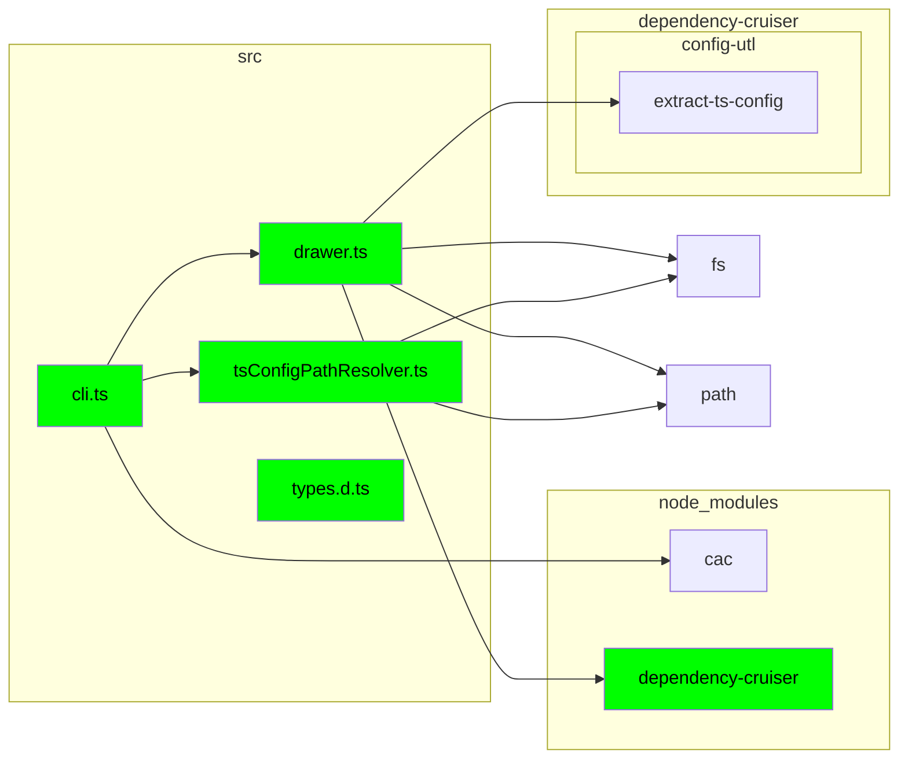

# Module Dependency Graph in src

<!-- DMDG BEGIN -->

```mermaid
flowchart LR

subgraph 0["dependency-cruiser"]
subgraph 1["config-utl"]
2["extract-ts-config"]
end
end
3["fs"]
subgraph 4["node_modules"]
5["cac"]
6["dependency-cruiser"]
end
7["path"]
subgraph 8["src"]
9["cli.ts"]
a["drawer.ts"]
b["tsConfigPathResolver.ts"]
c["types.d.ts"]
end
9-->a
9-->b
9-->5
a-->6
a-->2
a-->3
a-->7
b-->3
b-->7

style 6 fill:lime,color:black
style 9 fill:lime,color:black
style a fill:lime,color:black
style b fill:lime,color:black
style c fill:lime,color:black
```

<!-- DMDG END -->
